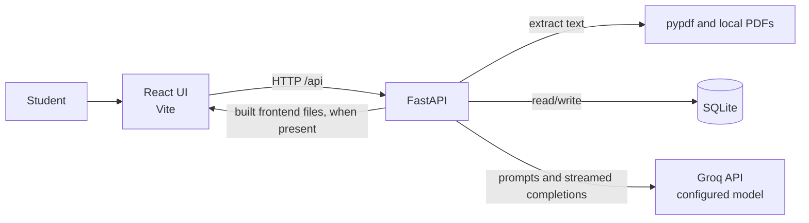

# StudyBuddy

**Turn your PDFs into a personal study space.** StudyBuddy uses AI to explain course material, build quizzes and flashcards, and track what you have learned.

[](https://react.dev/)
[](https://fastapi.tiangolo.com/)
[](https://sqlite.org/)
[](https://www.python.org/)

## Overview

StudyBuddy is a local web application for students who want to study from PDF course materials. It extracts text from uploaded PDFs and uses a Groq-hosted language model to create grounded explanations, practice questions, and review material. Study spaces, quiz activity, chat history, and flashcards are stored in a local SQLite database.

## Features

| Study space | What you can do |
| --- | --- |
| **Learn** | Browse AI-generated topics, ask for explanations, and transform text into summaries, sticky notes, or memorization aids. |
| **Chat** | Ask questions about your PDFs in a streamed conversation. |
| **Quiz** | Generate multiple-choice, true/false, fill-in, or short-answer questions; practise with feedback or take a timed exam. Review results by topic and revisit missed questions. |
| **Flashcards** | Generate cards from saved questions and sticky notes, then review due cards with spaced intervals. |
| **Progress** | See quiz accuracy, topic performance, activity, streaks, and card review progress. |
| **Study materials** | Combine up to 10 PDFs in a study space, view source PDFs, save questions, and export notes or Anki-compatible cards. |

## Tech stack

- **Frontend:** React 18, Vite, React Markdown, and Remark GFM
- **Backend:** Python 3.13+, FastAPI, Uvicorn, Pydantic
- **AI and documents:** Groq Python SDK (Chat Completions API), pypdf
- **Persistence:** SQLite; database and uploaded PDF files are local

## Architecture



The browser talks to FastAPI. During development, Vite proxies `/api` requests to `http://localhost:8000`. FastAPI persists study data in SQLite, stores original PDFs in `pdfs/`, and calls Groq for generated learning content. Text retrieval splits document text into chunks and ranks chunks by shared query words before building context for AI requests.

## Project structure

```text
.
├── main.py                    # FastAPI app, SQLite schema, AI workflows, and API routes
├── requirements.txt            # Python backend dependencies
├── pyproject.toml              # Project metadata and Python version requirement
├── pdfs/                       # Original uploaded PDFs (created at runtime; ignored by Git)
├── studybuddy.db               # SQLite data (created at runtime; ignored by Git)
└── frontend/
    ├── package.json            # Frontend scripts and dependencies
    ├── vite.config.js           # Dev server and /api proxy configuration
    └── src/
        ├── App.jsx              # Main UI and study workflows
        ├── api.js               # JSON and streaming fetch helpers
        ├── main.jsx             # React entry point
        └── styles.css           # Application styles
```

## Prerequisites

- Python **3.13 or newer**
- Node.js and npm
- A Groq API key

## Setup

1. Clone the repository and open its root directory.
2. Create and activate a Python virtual environment, then install the backend requirements:

   ```bash
   python -m venv .venv
   # macOS/Linux
   source .venv/bin/activate
   # Windows PowerShell (use this instead of the previous activation command)
   .venv\Scripts\Activate.ps1
   pip install -r requirements.txt
   ```

3. Create a `.env` file in the repository root and set `GROQ_API_KEY` as described below.
4. Start the backend from the repository root:

   ```bash
   uvicorn main:app --reload
   ```

   The API is available at `http://localhost:8000`.

5. In another terminal, install and start the frontend:

   ```bash
   cd frontend
   npm install
   npm run dev
   ```

   Open `http://localhost:5173`. Vite forwards `/api` requests to the backend on port 8000.

### Production build

Build the frontend and then start FastAPI from the repository root:

```bash
cd frontend
npm install
npm run build
cd ..
uvicorn main:app
```

When `frontend/dist` exists, FastAPI serves the built frontend at its root URL. Otherwise, `/` returns a message directing you to build the frontend or run Vite.

## Configuration

Put settings in the root `.env` file or provide them in the process environment. `main.py` loads `.env` at startup.

| Variable | Required | Default | Purpose |
| --- | --- | --- | --- |
| `GROQ_API_KEY` | Yes | — | API key used by the Groq client. Keep the actual secret private. |
| `MODEL` | No | `openai/gpt-oss-120b` | Model name sent to Groq Chat Completions. |
| `DB_PATH` | No | `studybuddy.db` | SQLite database file path. |
| `PDF_DIR` | No | `pdfs` | Directory for original uploaded PDF files. |

Example `.env` (replace the placeholder locally; do not commit a real key):

```dotenv
GROQ_API_KEY=your_groq_api_key_here
# MODEL=openai/gpt-oss-120b
# DB_PATH=studybuddy.db
# PDF_DIR=pdfs
```

Uploads are limited to 25 MB per PDF and 10 PDFs per study space. The backend currently configures browser CORS for `http://localhost:5173`.

## API

All application endpoints use the `/api` prefix. JSON request bodies are used unless an endpoint accepts multipart PDF files. FastAPI also provides its standard interactive API documentation at `/docs` while the server is running.

| Method | Endpoint | Purpose |
| --- | --- | --- |
| `POST` | `/api/upload` | Create a study space from one or more PDF files. |
| `GET` | `/api/docs` | List study spaces. |
| `GET`, `DELETE` | `/api/doc/{doc_id}` | Get study space status and activity, or delete it. |
| `POST` | `/api/doc/{doc_id}/sources` | Add PDF files to a study space. |
| `DELETE` | `/api/doc/{doc_id}/sources/{sid}` | Remove a source PDF. A study space must keep at least one source. |
| `GET` | `/api/doc/{doc_id}/pdf?source={sid}` | Serve an original source PDF for inline viewing. |
| `POST` | `/api/explain`, `/api/explain/stream` | Generate a material-grounded topic explanation, optionally streamed. |
| `POST` | `/api/transform`, `/api/transform/stream` | Summarize, create sticky notes, or produce memorization help. |
| `POST` | `/api/topic/describe` | Get or create a cached short topic description. |
| `POST` | `/api/chat/stream`; `GET`, `DELETE` `/api/chat/{doc_id}` | Stream a study-space chat reply, read chat history, or clear chat. |
| `POST` | `/api/quiz/start`, `/api/quiz/retry` | Start a quiz or retry missed questions. |
| `GET` | `/api/quiz/{qid}`; `POST` `/api/quiz/{qid}/more`, `/progress`, `/answer`, `/finish`; `GET` `/results` | Fetch quiz state, generate more questions, save progress/answers, finish, and view results. These routes share the `/api/quiz/{qid}` prefix. |
| `POST`, `GET` | `/api/saved` | Save a question or list saved questions (`GET` accepts `doc_id`). |
| `DELETE` | `/api/saved/{sid}` | Remove a saved question. |
| `POST` | `/api/cards/generate` | Generate flashcards from saved study content. |
| `GET` | `/api/cards/{doc_id}/stats`, `/due` | Get flashcard counts and due cards. |
| `POST` | `/api/cards/{card_id}/review` | Record a flashcard rating and schedule its next review. |
| `GET` | `/api/dashboard/{doc_id}` | Get learning progress and activity data. |
| `GET` | `/api/export/{doc_id}/notes.md`, `/anki.txt` | Export notes or Anki-compatible flashcards. |
| `DELETE` | `/api/messages/{doc_id}` | Clear the Learn conversation history. |

## Core workflows

### PDF to study space

The upload endpoint accepts PDFs, extracts page text with pypdf, saves each original file under its source ID, and records extracted text and metadata in SQLite. Topic extraction runs in the background through the configured Groq model. A study space can contain up to 10 PDFs.

### Grounded learning and chat

For a prompt, StudyBuddy builds text chunks from the study material. If the full material exceeds the context limit, it ranks chunks by word overlap with the query and sends selected context to Groq. Explanations can be returned as JSON or streamed as plain text; chat replies are streamed. Chat and explanation history is saved with the study space.

### Quiz and review

Questions are generated progressively for practice quizzes and prepared up front for exam mode. Practice gives immediate feedback; exams support a time limit and show results after completion. Answers are recorded for topic results, missed-question retries, and progress summaries.

### Flashcards and scheduling

Flashcards can be generated from saved quiz questions and Learn sticky notes. A review rating updates the card's ease, interval, repetition count, and due date. Progress combines quiz answers and card reviews.

## Usage

1. Start the backend and frontend, then open the Vite URL.
2. Upload one or more text-readable PDFs to create a study space. Scanned PDFs without extractable text are rejected.
3. Select the study space and use **Learn** or **Chat** to ask about its material.
4. In **Quiz**, choose practice or exam mode, question count, difficulty, topic, and question types. Save questions or review the results.
5. In **Cards**, sync generated cards and rate each review. Use **Progress** to inspect study activity and results.
6. Use the study space export menu to download notes or Anki-compatible flashcards.

## Troubleshooting

- **Backend exits at startup:** Check that `GROQ_API_KEY` is set in the root `.env` file or environment.
- **AI requests fail:** Check that the key is valid and that `MODEL` names a model available to the Groq API account.
- **Frontend cannot reach the API:** Run FastAPI on port 8000 and Vite on port 5173; the Vite proxy targets `http://localhost:8000`.
- **PDF upload reports no readable text:** The PDF must contain extractable text; OCR is not implemented.
- **Port 5173 is unavailable:** The Vite config sets that port explicitly; free it before starting the dev server.

## License and acknowledgments

No license file or license declaration is present in this repository. AI-generated study content is provided through the Groq API; PDF text extraction uses pypdf.
